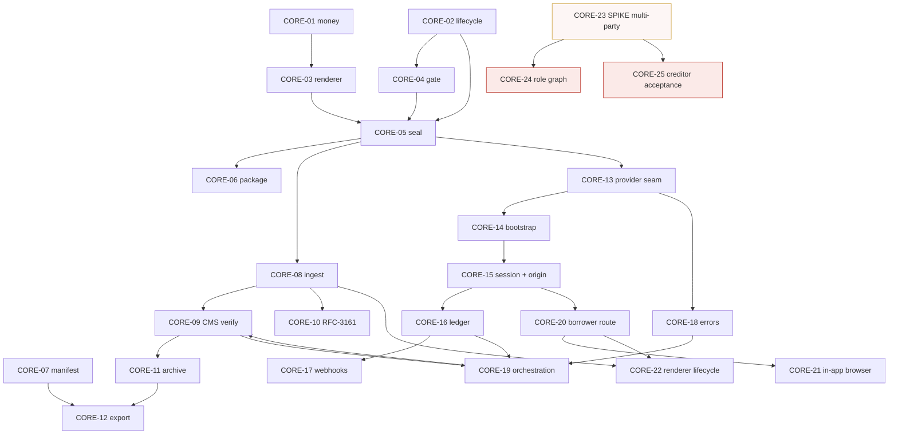

# BACKLOG-001 — The core, broken into tickets

Derived from `docs/research/RESULT-001-core-signing-evidence.md`. Section
references below (§) point into that document; it carries the evidence, this
carries the work.

**Scope.** The *core* as bounded in RESULT-001 §2.1: an instrument from the moment
its parameters are known until an evidence bundle about it is exported. Track D is
included because §7 recommends it even though the borrower surface sits on the
client-product side of the boundary. The dealership UI, borrower acquisition and
post-default collections are out of scope.

**Two rules this backlog encodes, both from the research:**

1. **Build the provider-free half first.** Tracks A and B depend on nothing Lakaut
   can change. They are also where the product's value sits — the precondition gate
   is what makes the pagaré enforceable and Lakaut never sees it (§1).
2. **Do not design multi-party until the sandbox answers.** CORE-23 is a one-day
   spike that either unblocks or kills CORE-24 and CORE-25. Building either before
   it is speculative work on the largest open unknown in the investigation (§4.1–4.2).

Sizes are S (≤1 day), M (2–4 days), L (>1 week) for one engineer.

---

## Track A — Instrument (no external dependencies; start here)

### CORE-01 · Money and Argentine numeric primitives · **S**

**Why.** *"Money must never be a float"* is an explicit instruction from the
prototype brief, and every amount in the product is Argentine-formatted (`.`
thousands, `,` decimals).

**Scope.** Integer minor-unit money type; es-AR parse and format; the rounding
policy for derived figures (cuota, costo total, intereses).

**Done when.** No floating-point type appears anywhere in the money path, enforced
by a lint rule or type boundary. Round-trip property tests pass. The derived cuota
for `$1.900.000 / 24 / TNA 78,0 % / francés` reproduces the prototype's `$118.700`
and `$2.848.800` total, with the rounding rule written down and justified.

**Depends on.** Nothing.

---

### CORE-02 · Instrument aggregate and lifecycle state machine · **M**

**Why.** §2.3. The lifecycle has irreversible transitions that must be
unrepresentable-if-illegal, not merely documented.

**Scope.** States `DRAFT`, `BLOCKED`, `SEALED`, `AWAITING_SIGNATURES`,
`PARTIALLY_SIGNED`, `SIGNED`, `EVIDENCE_OPEN`, `EVIDENCE_COMPLETE`, plus
`ABANDONED` and `STUCK`. Transition guards. Supersession link for amendments.

**Done when.** Illegal transitions are rejected at the type or persistence layer.
A sealed instrument cannot be mutated by any code path. Amending a sealed
instrument produces a *new* instrument linked to the one it supersedes — never an
edit. `PARTIALLY_SIGNED` and `STUCK` are first-class and queryable, because
signature 1 is irreversible while signer 2 is outstanding.

**Depends on.** Nothing.

---

### CORE-03 · Template registry and deterministic renderer · **M**

**Why.** §2.2 op 1; §2.4 first extension point.

**Scope.** Versioned template references; params → canonical PDF bytes; byte
stability across runs and machines.

**Done when.** The same params against the same template version produce a
byte-identical PDF (no embedded timestamps, no non-deterministic font subsetting,
no locale drift). The template version is recorded on the instrument. The pagaré
template reproduces the prototype's S1 prose, including **both** signature blocks —
render them regardless of how the multi-party question resolves; what changes is
who fills them, not whether the instrument shows them.

**Depends on.** CORE-01.

---

### CORE-04 · Precondition gate · **M**

**Why.** §2.2 op 2. This is the operation the research identifies as the core's
real value, and it is entirely ours.

**Scope.** A rule engine over the draft: named rules, `blocking` or `advisory`
severity, human-readable reasons. Rule sets are data, scoped by jurisdiction and
instrument type — not code branches.

**Done when.** *Lugar de pago* and *integración de consumo* exist as the first rule
set, reproducing S1's blocking behaviour and its exact reason strings. A `BLOCKED`
instrument cannot reach `SEALED` through any path. An empty rule set is valid and
yields an immediately issuable instrument — the mechanism must degrade cleanly for
instruments with no formal requisites (§2.6).

**Depends on.** CORE-02.

---

### CORE-05 · Seal operation and document identity · **M**

**Why.** §2.3, first irreversible transition. Forced by `SIGN_DOCUMENT_CONFLICT`,
which is terminal: a `documentId` reused with different content kills the flow.

**Scope.** Freeze bytes; compute and store the content hash; allocate a
`documentId` matching `^[A-Za-z0-9._:-]{1,120}$`; validate the `%PDF-` header and
the 20 MB ceiling before anything leaves our infrastructure.

**Done when.** `documentId` reuse across differing content is **structurally
impossible**, not just discouraged. Post-seal mutation attempts fail loudly.
Oversized or non-PDF input is rejected locally, never discovered via a provider
error. The id allocation scheme is documented and stable across environments.

**Depends on.** CORE-02, CORE-03, CORE-04.

---

### CORE-06 · Instrument package (ordered document set) · **M**

**Why.** §3.2. An origination needs pagaré **plus** prenda form **plus** consumer
disclosure, and B2 resolved positively: Lakaut supports multiple documents per
session, sequentially, with a distinct `documentId` each. The hypothesis's singular
*"a document"* is a prototype artefact (§2.6).

**Scope.** An ordered set of sealed documents sharing one ceremony; per-document
completion tracking; package-level completeness.

**Done when.** A package is complete only when *every* document's authoritative
receipt is confirmed. A mid-package failure is representable and recoverable
without re-signing what is already signed.

**Depends on.** CORE-05.

---

## Track B — Evidence and custody

### CORE-07 · Evidence bundle manifest model · **M**

**Why.** §3.8. Rendering five equal green ticks, as the prototype does, would
overstate two of the five items.

**Scope.** Per item: producer, obtained-at, hash, and an explicit `substantiation`
field recording whether we hold the evidence or only a reference to someone else's.
Additive schema.

**Done when.** The RENAPER item is representable honestly as a certificate-derived
assertion with a stated basis, distinct in the type system from an attestation we
hold. A new item kind can be added without a migration.

**Depends on.** Nothing — can run parallel to Track A.

---

### CORE-08 · Signed-artifact ingest endpoint · **M**

**Why.** §3.9. No Lakaut channel returns the signed bytes; the only copy arrives
through the borrower's browser, and if we lose it nobody can give it back.

**Scope.** Authenticated, size- and type-limited, idempotent on
`sessionId + documentId + finalPdfHash`, `cache-control: no-store`.

**Done when.** A replayed upload is a no-op. Receipt alone never marks a document
signed. The endpoint returns only after durable persistence, so the browser
callback can safely resolve on its response.

**Depends on.** CORE-05.

---

### CORE-09 · CMS verification and custody establishment · **M**

**Why.** §3.9. This verification run *is* the moment custody is established — it is
the only bridge between the authoritative `signedContentHash` and the bytes we
actually hold.

**Scope.** `verifySignedPdfArtifact(artifact, authority, { cmsVerifier })` — three
positional arguments, not an options object. `OpenSslCmsVerifier` requires
`openssl` in the runtime.

**Done when.** Document verdicts (`signed_document_authority_mismatch`,
`signed_pdf_hash_mismatch`, `signed_pdf_content_hash_mismatch`,
`signed_document_verification_failed`) are never archived as probative and are
alerted. Environment failures (`_verifier_unavailable`, `_timeout`, `_busy`) are
retried before any conclusion about the document. `openssl` presence is asserted at
boot, not discovered at the first signature.

**Depends on.** CORE-08, CORE-19 (for authoritative status).

---

### CORE-10 · Independent RFC-3161 timestamp at ingest · **S**

**Why.** §3.9. No trusted timestamp is documented anywhere in Lakaut's SDK —
`signedAt` appears in all three structures, a TSA token in none. For a 24-month loan
enforced after default, proving the signature predates certificate expiry is
precisely the question that matters.

**Scope.** Timestamp the archived artefact at ingest against an independent TSA;
store the token alongside the evidence object.

**Done when.** The token verifies offline. A TSA outage does not lose the
artefact, but is alerted and backfilled.

**Depends on.** CORE-08.

**Keep this even if Lakaut confirms their own timestamp** — it is cheap, it is
provider-independent, and it is one of the strongest arguments for the core owning
custody rather than the adapter.

---

### CORE-11 · Evidence archive (WORM) · **M**

**Why.** §3.9 and the vendor's own security requirements for signed PDFs.

**Scope.** Bytes, evidence object and raw webhook envelopes archived *together*.
Encryption in transit and at rest; access control; retention policy; traceability.

**Done when.** Archived objects are immutable. Retrieval is audited. Nothing from
the never-log list — API key, `clientToken`, OTP, DNI, sexo, PIN, PDF, biometric
evidence, JWT — appears in any log, verified by a test.

**Depends on.** CORE-09.

---

### CORE-12 · Bundle assembly and export snapshot · **M**

**Why.** §2.2 op 9. The bundle contains a time-dependent figure, so it is
inherently an `asOf` snapshot, and an exported bundle is irreversible in practice.

**Scope.** `asOf` snapshot; manifest hash; exported-by and exported-at log.

**Done when.** The same `asOf` over the same inputs reproduces the same manifest
hash. Every export is immutable and logged. The liquidación is a pure, reproducible
function of instrument + calendar + payment history.

**Depends on.** CORE-07, CORE-11.

---

## Track C — Lakaut adapter and ceremony orchestration

### CORE-13 · Provider seam · **S**

**Why.** §2.5, §3.10. Keep the dependency direction right without over-generalising
against an imaginary second provider.

**Scope.** `SignatureProvider` with `openCeremony` / `authoritativeStatus` /
`verifyArtifact`. Exactly one implementation.

**Done when.** No `@lakaut/*` import exists outside the adapter package, enforced by
a dependency rule. The interface is not generalised beyond what one real provider
needs.

**Depends on.** CORE-05.

---

### CORE-14 · Lakaut client bootstrap and catalogue assertion · **M**

**Why.** §3.6. Journeys and profiles come from a server-side catalogue whose
contents are set commercially; hardcoding the matrix is explicitly warned against.

**Scope.** `HttpAuthTransport` / `SessionClient` configuration; secrets from a
manager; exact pinned versions across all three packages; `getCatalog()` asserted at
boot; **always send `authenticationProfileId` explicitly.**

**Done when.** Boot fails loudly on an unexpected journey/profile combination rather
than at a borrower's first signature. No `latest`, ranges or git dependencies in the
lockfile. The explicit-profile policy is enforced, sidestepping the documented
default divergence where `{flowType:"SIGNING"}` demands SMS and
`{journeyId:"journey.signing.v1"}` does not.

**Depends on.** CORE-13.

---

### CORE-15 · Session creation and origin policy · **M**

**Why.** §3.3. `allowedOrigin` must be one exact origin, validated against our own
tenant list — the dashboard declaration *"no reemplaza tu propia validación"*.

**Scope.** Per-request origin resolution against a server-side allowlist;
`toRendererContext()` only, never a hand-built object; `assertBrowserSafeSessionOutput`
on the way out. Start with a single declared origin, keeping a `TenantOriginPolicy`
seam.

**Done when.** `identitySubject` and `continuationFromSessionId` cannot reach the
browser, verified by a test. An unrecognised origin is rejected before any Lakaut
call. Responses carry `cache-control: no-store`. The endpoint authenticates and
authorises the caller.

**Depends on.** CORE-14.

---

### CORE-16 · Session ledger · **S**

**Why.** §3.4 and §2.3(a). `sessionId` is the join key — there is no tenant
dimension in the API and the documented webhook payload carries no
`externalUserRef`. The only route to a receipt is
`/sessions/{sessionId}/documents/{documentId}/status`, so losing the `sessionId`
loses the ability to re-derive proof.

**Scope.** `sessionId → (tenant, instrument, document, role)` plus `correlationId`,
written **before** the context leaves the backend, retained indefinitely.

**Done when.** The mapping is durable before any browser handoff, survives session
terminal states, and lets us re-fetch a receipt years later. `externalUserRef` is
treated as a diagnostic aid only — nothing routes on it.

**Depends on.** CORE-15.

---

### CORE-17 · Webhook ingress · **M**

**Why.** §3.4.

**Scope.** Raw body preserved; `constructWebhookEvent`; 300 s tolerance with the
ISO-8601 `t=` (not epoch); dedup on the envelope's `idempotencyKey`;
persist-then-act; 2xx only on acceptance.

**Done when.** A test proves that parsing and re-serialising the body fails
verification — the classic integration bug, guarded against explicitly. Duplicate
delivery is a no-op. An event for an unknown `sessionId` is persisted and alerted,
**never dropped**: it is the signature of a routing bug with irreversible business
meaning behind it.

**Depends on.** CORE-16.

---

### CORE-18 · Error taxonomy adapter · **S**

**Why.** §3.10. There is a documented production incident behind this:
`CERTIFICATE_NOT_AVAILABLE` fell through another integrator's generic path and
destroyed a signing flow in progress.

**Scope.** All 34 `LakautSdkErrorCode` values mapped to `retry-in-step`, `terminal`
or `session-recovery`. Unknown ⇒ `retry-in-step`. Decide by code, never by HTTP
status.

**Done when.** An exhaustiveness test covers the full code list and fails when the
SDK adds one. `CERTIFICATE_NOT_AVAILABLE`, `SIGN_PIN_INVALID`, `OTP_INVALID` and
`RATE_LIMITED` are all retryable. An unrecognised code never recreates the session —
that is what makes a borrower repeat OTP, identity and certificate steps they have
already completed. Type against `LakautSdkErrorCode` (34), not `SdkPublicErrorCode`
(19).

**Depends on.** CORE-13.

---

### CORE-19 · Ceremony orchestration and authoritative reconciliation · **L**

**Why.** §2.2 ops 4 and 6; the three-channel rule — only the backend is truth.

**Scope.** One ceremony = one sealed document (or package) + one signer role.
Authoritative status via `getSession` / `getSignedDocumentStatus`. Retry-in-step
preserves session, document and step, clearing only the PIN.

**Done when.** `lakaut.flow.completed` alone never marks anything signed.
`completeSession` is called only after every document's receipt is confirmed and
business effects have settled. `signed_document_delivery_failed` triggers
reconciliation, **never a second signature** — the document is already signed.
Double-submit is prevented while a request is in flight.

**Depends on.** CORE-16, CORE-18, CORE-09.

---

## Track D — Borrower surface

### CORE-20 · Borrower route sized for the hosted iframe · **M**

**Why.** §3.7. The iframe is a fixed 810 px tall (minimum 680 px), full width, and
does not adapt to content or container.

**Scope.** A dedicated HTTPS route that yields its layout to the iframe; correct
viewport meta; CSP `frame-src` and `Permissions-Policy` naming the Hosted UI origin.

**Done when.** Verified on real handsets at 360×640 and 390×844 with no clipping.
No ancestor applies `overflow:hidden` or a CSS transform that could cut Veriff. All
borrower-facing reading material (the prototype's S3 and S4) happens *before* the
mount, because we cannot render around the ceremony on mobile.

**Depends on.** CORE-15.

---

### CORE-21 · In-app browser detection and hand-off · **S**

**Why.** §3.7. The link arrives by WhatsApp, and in-app webviews are the classic
failure surface for camera access. Nothing in Lakaut's docs addresses them.

**Scope.** Detect the in-app webview and route the borrower to the system browser
before mounting. Handle `identity_camera_blocked` and `identity_frame_blocked` with
a real recovery path.

**Done when.** The WhatsApp webview never reaches the mount step untested, and a
borrower who lands there gets a working route out rather than a dead camera.

**Depends on.** CORE-20.

---

### CORE-22 · Renderer lifecycle and signed-document upload · **M**

**Why.** Hosted UI and document-delivery contracts.

**Scope.** `mount()` / `destroy()` discipline; `onDocumentSigned` resolving only
after our backend confirms receipt; the borrower's download option preserved.

**Done when.** `destroy()` runs on unmount so no `message` listener survives
navigation. The callback resolves strictly after a 2xx from CORE-08. A rejected
callback leaves the borrower able to download their copy and leaves the backend able
to reconcile.

**Depends on.** CORE-20, CORE-08.

---

## Track E — Blocked and spikes

### CORE-23 · SPIKE: multi-party signature behaviour · **S**, blocking

**Why.** §4 ranks 1 and 2 — the two largest risks in the investigation. This spike
settles both.

**Scope.** RESULT-001 §6 items 1–2. Sign `doc-A`; feed the artefact bytes as input
to a second session with a different titular; then repeat with the same
`documentId`. Record whether it completes, whether both receipts resolve, whether
`verifySignedPdfArtifact` still succeeds against the original evidence, and whether
`openssl cms -verify` finds one signer or two.

**Done when.** A written verdict exists that either unblocks CORE-24 or kills it.

**Blocked by.** Sandbox credentials. **This is the single highest-value hour in the
backlog** — until it runs, any multi-party design is speculation.

---

### CORE-24 · Signer role graph and multi-ceremony saga · **M** — **BLOCKED on CORE-23**

Model N ceremonies over one sealed document or package, with ordering and a
definition of role completeness. Do not start before CORE-23 reports.

---

### CORE-25 · Creditor acceptance design · **M** — **BLOCKED on CORE-23 + a legal decision**

If the second signature does not survive, or persona jurídica remains unsupported,
creditor acceptance becomes a separate countersignature document referencing the
instrument's `signedContentHash`. That is a different data model, and the research
recommends evaluating it **first** rather than as a fallback (§3.1). Needs a legal
call on whether a pagaré carrying only the debtor's signature is acceptable.

---

### CORE-26 · Repeat-borrower flow selection · **M** — **BLOCKED on Lakaut Q6–10**

No certificate lookup exists, the certificate lifetime is unknown, and **no PIN
recovery flow is documented anywhere**. Ship v1 assuming first-time borrowers and
our own holder projection. Do not design a PIN-recovery UX for a mechanism that may
not exist.

---

## Cross-cutting

### CORE-27 · Email capture in origination · **S**

**Why.** §3.6. `journey.onboarding*.v1` admits only `auth.email-sms.v1`, and
`requiredInputs` always leads with `EMAIL` — so **onboarding requires an email
address**. The prototype's borrower is a WhatsApp contact and no email is ever
captured.

**Done when.** The origination form captures and validates an email for every
first-time borrower, as a blocking field. Cheap to fix now; embarrassing to discover
during the first sandbox run.

**Depends on.** Nothing.

---

### CORE-28 · Observability and redaction · **S**

**Why.** `correlationId` is the only handle support can trace, and the never-log
list is non-negotiable.

**Scope.** Structured logging of `environment`, `integratorId`, `sessionId`,
`documentId`, `correlationId`, `errorCode`, `timestamp`. Redaction enforced in code.

**Done when.** `correlationId` is stored on every ceremony and present in every
related log line. A test asserts that the never-log values cannot reach a log sink.

**Depends on.** CORE-16.

---

## Dependency graph

CORE-09 and CORE-19 are mutually referential by design: verification needs
authoritative status, and orchestration must not complete a session until
verification has run. Build the status call inside CORE-19 first, then close the
loop.

---

## Suggested sequencing

**Sprint 1 — provider-free foundation, plus the unblocking spike.**
CORE-01, CORE-02, CORE-03, CORE-04, CORE-05, CORE-27, and **CORE-23 as soon as
sandbox credentials exist**. Nothing here can be invalidated by a Lakaut answer.

**Sprint 2 — custody and the adapter seam.**
CORE-06, CORE-07, CORE-08, CORE-13, CORE-14, CORE-18. The error taxonomy is small
and high-consequence; do not defer it to the end.

**Sprint 3 — the live path.**
CORE-15, CORE-16, CORE-17, CORE-19, CORE-09, CORE-10, CORE-20.

**Sprint 4 — close the loop.**
CORE-11, CORE-12, CORE-21, CORE-22, CORE-28. Then re-plan Track E against whatever
CORE-23 and the Lakaut email have returned.

## Do not start

CORE-24, CORE-25 and CORE-26 until their blockers clear. Also: do not generalise
`SignatureProvider` beyond one real implementation, and do not build per-tenant
origins or per-tenant integrations until Lakaut answers questions 19–21. Both are
cheap to get right now and expensive to unwind later.

---

## Filed issues

All 28 tickets exist as issues in this repository. Dependencies are cross-linked between them.

| Ticket | Issue | Ticket | Issue |
| --- | --- | --- | --- |
| CORE-01 | #3 | CORE-15 | #17 |
| CORE-02 | #4 | CORE-16 | #18 |
| CORE-03 | #5 | CORE-17 | #19 |
| CORE-04 | #6 | CORE-18 | #20 |
| CORE-05 | #7 | CORE-19 | #21 |
| CORE-06 | #8 | CORE-20 | #22 |
| CORE-07 | #9 | CORE-21 | #23 |
| CORE-08 | #10 | CORE-22 | #24 |
| CORE-09 | #11 | CORE-23 | #25 |
| CORE-10 | #12 | CORE-24 | #26 |
| CORE-11 | #13 | CORE-25 | #27 |
| CORE-12 | #14 | CORE-26 | #28 |
| CORE-13 | #15 | CORE-27 | #29 |
| CORE-14 | #16 | CORE-28 | #30 |
