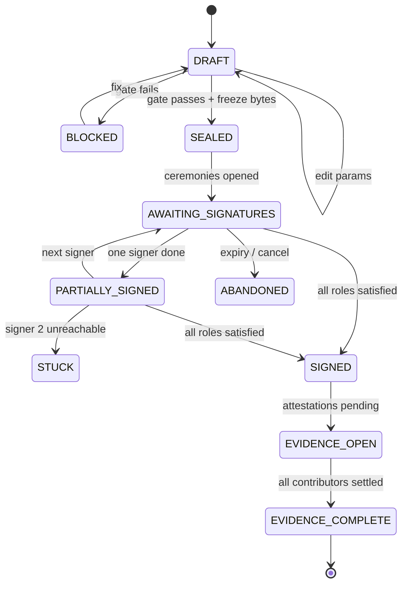

# RESULT-001 — Is there a generalisable signing + evidence core?

Answers INVESTIGATION-001. Research only; no implementation was written.

**Sources.** Everything cited is in this repository. Citation shorthand:

| Tag | File |
| --- | --- |
| `[agentes]` | `docs/vendor/lakaut/sdk-integracion__agentes.md` |
| `[api]` | `docs/vendor/lakaut/sdk-integracion__referencia-api.md` |
| `[sesiones]` | `docs/vendor/lakaut/sdk-integracion__backend-sesiones.md` |
| `[firma]` | `docs/vendor/lakaut/sdk-integracion__documentos-firma.md` |
| `[identidad]` | `docs/vendor/lakaut/sdk-integracion__flujos-identidad.md` |
| `[eventos]` | `docs/vendor/lakaut/sdk-integracion__eventos-estado.md` |
| `[errores]` | `docs/vendor/lakaut/sdk-integracion__errores.md` |
| `[seguridad]` | `docs/vendor/lakaut/sdk-integracion__seguridad.md` |
| `[credenciales]` | `docs/vendor/lakaut/sdk-integracion__credenciales.md` |
| `[webhook]` | `docs/vendor/lakaut/sdk-integracion__configurar-webhook.md` |
| `[dashboard]` | `docs/vendor/lakaut/sdk-integracion__dashboard-integrador.md` |
| `[hosted-ui]` | `docs/vendor/lakaut/sdk-integracion__frontend-hosted-ui.md` |
| `[arquitectura]` | `docs/vendor/lakaut/sdk-integracion__arquitectura.md` |
| `[ambientes]` | `docs/vendor/lakaut/sdk-integracion__ambientes-versionado.md` |
| `[quickstart]` | `docs/vendor/lakaut/sdk-integracion__quickstart.md` |
| `[ejemplo]` | `docs/vendor/lakaut/sdk-integracion__ejemplo-completo.md` |
| `[sdk]` | `docs/vendor/lakaut/sdk.md` |
| `[c-tiempo]` | `docs/vendor/lakaut/conceptos__marco-legal__timestampings.md` |
| `[c-validez]` | `docs/vendor/lakaut/conceptos__marco-legal__validez-legal.md` |
| `[c-cert]` | `docs/vendor/lakaut/conceptos__fundamentos__certificados-digitales.md` |
| `[c-ocsp]` | `docs/vendor/lakaut/conceptos__verificacion-revocacion__OCSP-CRL.md` |
| `[proto]` | `docs/vendor/prototipo/prototipo-lucero-v2.dc.html` |
| `[brief]` | `docs/vendor/prototipo/README.md` |

Claims carry **[Documented]**, **[Inferred]** or **[Unknown]** as the ticket requires.

---

## 1. Verdict

**A core exists, and it generalises — but it is not the core the hypothesis
describes.** The durable thing underneath the vehicle-loan product is not "sign a
document"; it is *produce and hold an evidence record about an instrument whose
enforceability was established before anyone signed it*. Three of the five items
the prototype puts in its evidence bundle have nothing to do with signing
[Documented: `[proto]` S8], and the two rules that gate the whole flow — *lugar de
pago* and *integración de consumo* — are enforceability preconditions that Lakaut
never sees [Documented: `[proto]` S1]. Swap the pagaré for a lease, a mutuo, or a
consumer-credit disclosure pack and the same four things survive: a templated
instrument, a precondition gate that decides whether it is issuable, one or more
signature ceremonies against frozen bytes, and a custodial evidence bundle that
mixes signature evidence with attestations we obtain elsewhere and derivations we
compute. That core is real, and it is worth building.

**The hypothesis is wrong in two specific, load-bearing places.** First,
*"one or more signer identities"* is not a parameter the core can accept, because
Lakaut's unit of work is one document signed by one persona-física certificate:
the session authenticates a single titular, the authoritative receipt carries a
single `certificateRef` and a single `signerCertificateFingerprint`
[Documented: `[firma]` §"Consultar la constancia", §"Custodia probatoria"], and the
signing error catalogue speaks of *"un certificado de persona física válido"*
[Documented: `[errores]` `SIGN_CERTIFICATE_REQUIRED`]. The pagaré's *firma del
acreedor* — a company, CUIT 30-71234567-8 [Documented: `[proto]` S1, header] — has
no documented path at all. Multi-party is therefore not a field on a request; it is
a saga of N independent ceremonies that the core must orchestrate, and whether a
second signature can even coexist with the first on one PDF is **[Unknown]** and
existential (§3.1). Second, *"Lakaut is a swappable implementation of the identity
and signature step"* is true at the step boundary and false at the evidence
boundary. Lakaut returns no PDF bytes through any channel — the webhook carries a
receipt, not the file; `getSignedDocumentStatus` returns metadata, not bytes; the
only copy of the signed artefact reaches us through the borrower's browser
[Documented: `[firma]` §"Descargar y entregar no son lo mismo"]. That makes
*ingest-verify-archive* a mandatory core operation rather than a provider detail,
and it means the shape of our evidence bundle is partly dictated by what this
provider does and does not hand back. Build the core; do not call it
provider-agnostic until a second provider has been mapped onto it.

---

## 2. The core

### 2.1 Boundary

The core owns an **instrument** from the moment its parameters are known until the
moment an evidence bundle about it is exported. It does not own: how the
instrument's parameters were gathered, who the borrower is in business terms, how
the borrower is reached, what happens after default, or what a specific
jurisdiction requires. Those are the client product's.

```
        client product                      core                        adapters
  ┌───────────────────────┐   ┌───────────────────────────┐   ┌─────────────────────┐
  │ loan terms, borrower  │──▶│ draft → gate → seal       │──▶│ signature provider  │
  │ template + rules      │   │ ceremony orchestration    │   │  (Lakaut today)     │
  │ delivery channel      │   │ artefact ingest + verify  │   ├─────────────────────┤
  │ post-signature acts   │   │ evidence custody + export │◀──│ attestation sources │
  └───────────────────────┘   └───────────────────────────┘   │ (prenda registry…)  │
                                                              ├─────────────────────┤
                                                              │ derivations         │
                                                              │ (liquidación)       │
                                                              └─────────────────────┘
```

The single most important boundary decision: **the core is the system of record for
the signed bytes**, because Lakaut is not (§3.9).

### 2.2 Operations the core owns, end to end

1. **`draft(templateRef, params) → Instrument`** — render a canonical document from
   a versioned template. Owns: template version pinning, deterministic rendering,
   money-as-integers [Documented: `[brief]` §"Notes for the investigation"].
2. **`gate(instrument) → Issuable | Blocked[reasons]`** — evaluate the precondition
   rule set. This is the S1 validation panel generalised: *"No se puede enviar el
   instrumento hasta completar…"* [Documented: `[proto]` S1]. Rules are data, not
   code paths.
3. **`seal(instrument) → SealedDocument`** — freeze bytes, compute and record a
   content hash, allocate a stable `documentId`. **First irreversible transition.**
   Forced by Lakaut: `SIGN_DOCUMENT_CONFLICT` — *"Ese `documentId` ya se firmó con
   otro contenido"* — is terminal [Documented: `[errores]` §terminal], so a
   `documentId` must never be reused across differing content.
4. **`openCeremony(sealedDoc, signerRole) → Ceremony`** — ask the provider adapter
   for a signature ceremony for exactly one signer, and produce whatever handle the
   client product needs to deliver it (a URL, an embedded surface).
5. **`ingest(artifact) → VerifiedArtifact | CustodyFailure`** — receive the signed
   bytes from an untrusted path, cross-check them against the provider's
   authoritative status, verify the cryptographic signature, and archive. With
   Lakaut this is `verifySignedPdfArtifact(artifact, authority, { cmsVerifier })`
   plus `getSignedDocumentStatus` [Documented: `[firma]` §"Custodia probatoria"].
   **Second irreversible transition.**
6. **`reconcile(ceremony)`** — consume signed webhooks and authoritative status,
   idempotently, and settle the ceremony's outcome. The provider's own rule:
   *"La verdad final es el backend, no los eventos del browser"*
   [Documented: `[agentes]` §"Reglas que no se negocian"].
7. **`attach(evidenceItem)`** — record an externally produced attestation (prenda
   registration certificate, a registry constancia) with its own provenance,
   obtained-at time and hash.
8. **`derive(instrument, asOf) → Derivation`** — compute a time-dependent figure
   (the liquidación) as a pure, reproducible function of instrument + calendar +
   payment history.
9. **`assemble(instrument, asOf) → EvidenceBundle`** — produce a snapshot manifest
   over items 5, 7 and 8, hash it, and record who exported it and when.
   **Third irreversible transition** in practice: once handed to a third party, it
   is out of our control.

Operations 1–3 and 5–9 are ours in full. Only 4 delegates, and it delegates less
than the hypothesis assumes.

### 2.3 State the core owns, and its lifecycle



Per-ceremony sub-state mirrors the provider. Lakaut's is `created`, `in_progress`,
`started`, `completed`, `cancelled`, `failed`, `expired`; terminal are the last
four; `started` exists in the SDK type but the backend does not emit it today
[Documented: `[sesiones]` §"Estado autoritativo"].

**Irreversible transitions, and why each is irreversible:**

| Transition | Why it cannot be undone |
| --- | --- |
| `DRAFT → SEALED` | The `documentId`↔content binding becomes permanent at the provider; changing content under the same id is terminal [Documented: `[errores]` `SIGN_DOCUMENT_CONFLICT`]. An amended instrument is a *new* instrument. |
| any → first successful signature | The cryptographic operation happened in Lakaut's infrastructure. `signed_document_delivery_failed` explicitly means *"el documento ya está firmado. No volver a firmarlo"* [Documented: `[agentes]` §"Documentos firmados"]. Our failure to receive the bytes does not un-sign them. |
| `PARTIALLY_SIGNED → STUCK` | Recoverable in business terms but not in document terms: signature 1 exists on bytes that cannot now change. |
| bundle export | A bundle handed to a court, a lawyer or a counterparty cannot be recalled; therefore every export must be immutable, hashed and logged. |

Two consequences worth stating plainly. **(a)** The `sessionId`↔`documentId`↔
instrument mapping must be persisted forever, not until completion: the only route
to the authoritative receipt is `GET /v1/sdk/sessions/{sessionId}/documents/{documentId}/status`
[Documented: `[agentes]` §"Resto"], so losing the `sessionId` loses the ability to
re-derive proof. The vendor's own example does exactly this binding at creation
time — `applications.bindSdkSession(application.id, created.sessionId)`
[Documented: `[ejemplo]` §Backend]. **(b)** `correlationId` must be stored with it;
it is the only handle support can trace [Documented: `[errores]` §"Diagnóstico mínimo"].

### 2.4 Extension points

| Extension point | What a second client product supplies | Why it must be an extension point |
| --- | --- | --- |
| **Instrument template** | A versioned renderer producing canonical bytes | The pagaré's prose, its `N.º 2026-04-0187 · Res. Gral. 1060/2025` header, its two signature blocks [Documented: `[proto]` S1] are entirely product-specific |
| **Precondition rule set** | Named rules with blocking/advisory severity and human-readable reasons | *Lugar de pago* and *integración de consumo* are Argentine-pagaré rules; a lease has different ones |
| **Signer role graph** | Roles, required identity assurance, ordering, and what "complete" means | The pagaré has debtor + creditor; a mortgage adds guarantor and spousal consent |
| **Delivery channel** | How a ceremony handle reaches a signer | WhatsApp to `+54 9 11 5555-1234` [Documented: `[proto]` S2] is one choice among many |
| **Evidence contributors** | Sources that attest to something the core did not produce | Prenda registration is a registry act, not a signature act |
| **Derivations** | Time-dependent computations over the instrument | Liquidación is credit-specific; many instruments have none |
| **Identity + signature provider** | Adapter implementing `openCeremony` / `authoritativeStatus` / `verifyArtifact` | The only place Lakaut should appear |
| **Retention & export policy** | Formats, redaction, jurisdictional retention | Varies by jurisdiction and counterparty |

### 2.5 Type sketches

Illustration only — deliberately provider-free at the top, provider-shaped only in
the adapter.

```ts
type InstrumentId = string & { readonly __brand: "InstrumentId" };
type Minor = bigint; // money is never a float

interface SealedDocument {
  documentId: string;          // ^[A-Za-z0-9._:-]{1,120}$  — provider-constrained
  contentHash: string;         // ours, computed at seal time
  bytes: Uint8Array;           // ≤ 20 MB, %PDF- header      — provider-constrained
  templateRef: { id: string; version: string };
  sealedAt: string;
}

interface GateResult {
  issuable: boolean;
  findings: { rule: string; severity: "blocking" | "advisory"; reason: string }[];
}

interface SignerRole {
  role: string;                       // "deudor" | "acreedor" | ...
  assurance: "qualified" | "advanced";
  subject: { kind: "natural"; nationalId?: string } | { kind: "legal"; taxId: string };
}

// One ceremony = one signer over one sealed document. Not negotiable (§3.1).
interface Ceremony {
  ceremonyId: string;
  documentId: string;
  role: SignerRole["role"];
  providerRef: { sessionId: string; correlationId: string };
  state: "open" | "completed" | "cancelled" | "failed" | "expired";
}

interface SignatureEvidence {           // what we can actually prove
  signedContentHash: string;            // authoritative
  finalPdfHash: string;                 // browser-reported only (§3.9)
  algorithm: "SHA-256" | "SHA-384" | "SHA-512";
  signerCertificateFingerprint: string;
  certificateRef: string;
  signedAt: string;                     // provider-asserted; TSA status [Unknown]
  verifiedAt: string;
  verifierVersion: string;
}

interface EvidenceBundle {
  instrumentId: InstrumentId;
  asOf: string;
  signatures: SignatureEvidence[];      // plural: one per ceremony
  attestations: { kind: string; source: string; obtainedAt: string; hash: string }[];
  derivations: { kind: string; asOf: string; inputsHash: string; result: Minor }[];
  manifestHash: string;
  exportedBy: string;
}

interface SignatureProvider {           // the only Lakaut-shaped seam
  openCeremony(doc: SealedDocument, role: SignerRole): Promise<Ceremony>;
  authoritativeStatus(c: Ceremony): Promise<CeremonyStatus>;
  verifyArtifact(raw: unknown, c: Ceremony): Promise<SignatureEvidence>;
}
```

### 2.6 Which prototype concepts are genuinely universal — both sides

**Argued universal, and I believe it:**

- *Precondition gate.* **For:** every enforceable instrument has formal requisites,
  and discovering a missing one after signature is catastrophic in any
  jurisdiction; a gate that blocks issuance is the general form. **Against:** we
  have exactly two rules, both Argentine and both pagaré-specific, and it is
  possible that other instruments have zero blocking requisites, making the gate
  degenerate. **Resolution:** universal as a *mechanism*, empty-able as a
  *configuration*. Cheap to keep, expensive to retrofit.
- *Sealed bytes.* **For:** the provider forces it (`SIGN_DOCUMENT_CONFLICT`), and
  any signature scheme requires stable content. **Against:** none found. This is
  the strongest universal in the set.
- *Evidence bundle as a snapshot.* **For:** the bundle contains a time-dependent
  figure, so it is inherently `asOf`; that is true of any instrument with accruing
  obligations. **Against:** for an instrument with no derivations the snapshot
  collapses to a static archive, and the versioning machinery is dead weight.
- *Ingest-verify-archive.* **For:** any provider that hands the artefact through a
  client surface creates the same custody problem. **Against:** a provider that
  stores and serves the signed PDF itself (many do) makes this optional — so it is
  universal to *our* core only because of *this* provider. Honest label: universal
  to the core, provider-motivated.

**Looks universal, is probably an artefact of having one example:**

- *"A document", singular.* The hypothesis says one document; the ticket's own B2
  says an origination needs pagaré + prenda form + consumer disclosure. The unit is
  an **instrument package** — an ordered set — and the single-document framing is a
  prototype artefact [Documented: `[proto]` shows only the pagaré].
- *Two signature blocks.* The pagaré's debtor/creditor pair is bill-of-exchange
  structure, not a general truth. A unilateral disclosure has one; a syndicated
  facility has many. Generalise to a *role graph*, not to "two".
- *Prenda registration as a bundle item.* Specific to registrable security
  interests over vehicles. Generalise to "third-party attestation", not to "prenda".
- *Liquidación.* Credit-specific. A lease has an arrears schedule, an employment
  agreement none.
- *WhatsApp delivery.* Argentine retail-credit distribution. Also, at present, in
  tension with Lakaut's onboarding requirement for an email address (§3.6).
- *RENAPER as "identity verified".* Argentine registry. Generalise to "identity
  assurance level with named method and evidence", not to "RENAPER".
- *One instrument per borrower per event.* The panel shows one row per loan
  [Documented: `[proto]` S7]. Refinancings, novations and amendments — where an
  instrument supersedes another — are entirely absent from the prototype and are
  the most likely modelling surprise in product two.

---

## 3. Constraints

### 3.1 Multi-party signing — **the existential one**

**Constraint.** A Lakaut session signs on behalf of exactly one authenticated
titular, and the artefacts describing a signed document model exactly one signer.

**Evidence.**
- `CreateSessionInput` carries one `email`, one `phone`, one
  `identitySubject { dni, sexo }` — a single natural person
  [Documented: `[api]` §`CreateSessionInput`].
- The authoritative receipt confirms *"referencia del certificado; fingerprint del
  certificado firmante"* — singular [Documented: `[firma]` §"Consultar la constancia"].
- `SignedPdfVerificationEvidence` has one `signerCertificateFingerprint` and one
  `certificateRef` [Documented: `[firma]` §"Custodia probatoria"].
- The signing flow ends at *"solicita la clave del certificado; firma y entrega el
  PDF"* — one PIN, one certificate [Documented: `[identidad]` §Firma].
- Signing requires *"un certificado de persona física válido"*
  [Documented: `[errores]` `SIGN_CERTIFICATE_REQUIRED`]. Onboarding issues
  certificates via Veriff + RENAPER over DNI and registral sex
  [Documented: `[identidad]` §Onboarding] — a natural-person pipeline. The general
  concepts page allows *"persona física o jurídica"* [Documented: `[c-cert]`], but
  **no SDK path to a legal-person certificate is documented anywhere**
  [Inferred from exhaustive absence across all 21 pages; refuted by Lakaut showing
  a `journey`/profile for persona jurídica].

**Can two parties sign one document?** Not in one session — that much is settled.
Sequential sessions over the same PDF are the only candidate, and they raise a
question the docs do not answer.

**Does a second signature invalidate the first?** **[Unknown]**, and the docs push
in an uncomfortable direction. The artefact exposes *two distinct hashes* —
`signedContentHash` and `finalPdfHash` [Documented: `[firma]` §artefact interface] —
which means the final file is not byte-identical to the content that was signed;
the signature is CMS, extracted from and validated against the signed content
[Documented: `[api]` §`verifySignedPdfArtifact`]. Feeding round 1's *output* PDF as
round 2's *input* therefore signs content that includes round 1's signature. Whether
Lakaut produces a PAdES-style incremental update that preserves the earlier
signature, or a fresh CMS that supersedes it, is not stated. What *is* stated is
that the verification helper and the constancia both model one signer per document,
so even a physically surviving first signature would have no first-class
representation in the evidence we can retrieve. **This must be tested before any
design commits** (§6, item 1).

**Consequence for the core.** Three, in order of severity.

1. Multi-party is an orchestration concern, not a request field. The core models
   `Ceremony` as (one sealed document, one role, one signer) and a `SignerRole`
   graph above it. The hypothesis's *"one or more signer identities"* must be struck.
2. `PARTIALLY_SIGNED` is a first-class, long-lived state with its own failure mode.
   Signature 1 is irreversible; if signer 2 never completes, we hold a
   half-executed instrument. The client product needs a documented remedy
   (re-issue as a new instrument — never an edit of the sealed one).
3. **The *firma del acreedor* likely cannot be a Lakaut digital signature at all**
   [Inferred: no persona-jurídica path documented; would be refuted by an
   affirmative answer from Lakaut]. Two viable fallbacks, both needing a legal call
   that is out of scope here: (a) a named human representative of the dealership
   signs with their own persona-física certificate — plausible under Lakaut's model
   but changes who is bound and how; (b) the creditor's acceptance is expressed by a
   separate countersignature document referencing the instrument's
   `signedContentHash`, which sidesteps the second-signature-on-one-PDF question
   entirely. Option (b) is more robust technically and is my recommendation to
   evaluate first (§7).

**Flag, as the ticket asks: this is unresolved and it is the single largest risk in
the investigation.** A pagaré with only the debtor's signature may still be the
product Lucero wants — many pagarés circulate that way — but that is a legal
determination nobody has made, and the prototype renders two blocks.

### 3.2 One document per session

**Constraint.** The renderer takes one `document` object; but a *session* is not
limited to one document.

**Evidence.** `HostedUiRendererOptions.document?: HostedUiDocument` is a single
object [Documented: `[api]` §`HostedUiRenderer`], with `documentId` matching
`^[A-Za-z0-9._:-]{1,120}$`, `mimeType: "application/pdf"`, `%PDF-` header, and a
20 MB ceiling [Documented: `[firma]` §"Opción A"]. But the vendor explicitly
supports multiple documents per session: *"Una sesión de firma permanece activa
hasta `completeSession`. Para varios documentos: procesá cada documento de forma
secuencial; asigná un `documentId` único; recibí cada PDF…; consultá sus
constancias; completá la sesión cuando no queden documentos pendientes"*
[Documented: `[firma]` §"Más de un documento"], reinforced by *"En firma, esto
permite procesar más de un documento antes de cerrarla"*
[Documented: `[sesiones]` §"Consultar y cerrar la sesión"].

**So: pagaré + prenda form + consumer disclosure is supported — in one session, one
signer, sequentially.** That is the good news of this investigation.

**What is not documented** is the client-side mechanic: whether one mounts a fresh
`HostedUiRenderer` per document against the same session, or whether the existing
renderer can be handed a second document. `destroy()`/`mount()` per document is the
only pattern consistent with the documented API surface [Inferred; confirmed or
refuted in one sandbox run, §6 item 2].

**Consequence for the core.** The unit of work is an **instrument package**, not a
document: an ordered list of sealed documents sharing one ceremony. Per-document
receipts are retrieved individually, and the package is complete only when every
document's constancia is confirmed — `completeSession` must not be called before
that [Documented: `[sesiones]` §"No llames `completeSession` hasta…"]. Sequencing
also means a mid-package failure leaves a partially signed *package*, which is a
second flavour of the §3.1 problem and needs the same treatment.

### 3.3 `allowedOrigin` and tenancy

**Constraint.** Every session is bound to one exact HTTPS origin, drawn from a
list enumerated by hand in the dashboard. Wildcards are not usable today.

**Evidence.**
- Declaration rules: HTTPS mandatory, full host, *"Sin path, query ni fragment"*,
  one origin per line [Documented: `[credenciales]` §"Dominios permitidos"].
- Wildcards: the form accepts `https://*.clientes.miempresa.com` but saving fails
  with *"Origin must use HTTPS and include a host"*; the capability exists
  downstream but *"hoy no hay camino desde el dashboard hasta ahí"*
  [Documented: `[credenciales]` §"Comodines: todavía no"].
- Even when wildcards arrive, the *session* value must stay concrete, because
  `postMessage` requires an exact target origin
  [Documented: `[credenciales]` §"El comodín no aplica a la sesión"; `[arquitectura]`
  §"Orígenes exactos"].
- The same declared list drives `frame-ancestors`; with nothing declared the policy
  is `frame-ancestors 'none'` [Documented: `[credenciales]` §"Embeber la Hosted UI"].
- Validation fails closed and opaquely: `403 FORBIDDEN_ORIGIN` without saying
  whether the origin was undeclared or the config had not propagated — *"Esa
  opacidad es a propósito"* [Documented: same section]. Config changes bump a
  revision and propagate non-atomically [Documented: `[ambientes]` §Preproducción].

**Tenancy models this permits.**

| Model | Viability | Notes |
| --- | --- | --- |
| One origin for all dealerships (`https://firma.lucero.com`), tenant in path/token | **Recommended.** Fully supported today | Matches `[proto]` S2's `https://firma.ejemplo.com/f/8H2K9Q` — the tenant is in the link, not the host. One declared origin, one CSP, no per-tenant config latency |
| Subdomain per dealership, enumerated | Works, but each new dealership needs a dashboard edit + propagation wait before it can transact | Onboarding a dealership becomes a config-change operation with a lead time, not a database insert |
| Subdomain per dealership via wildcard | **Not available** | And even then, per-session origin must be concrete, so the backend must still resolve and validate the origin per request |
| One Lakaut *integration* per dealership | Possible but multiplies everything: API key, Nexus credential, webhook URL+secret, declared domains, commercial scope, all per tenant [Documented: `[dashboard]` §"Qué administra cada parte"] | Only justifiable if dealerships must be separate legal signers/billing entities |

**Ceiling.** **[Unknown]** — no maximum number of declared origins appears anywhere.
Ask (§5).

**Consequence for the core.** `allowedOrigin` is resolved per request against
*our own* tenant list, never from a client-supplied header alone — the vendor's own
pattern keeps `ORIGENES_QUE_OPERO` server-side and warns that the dashboard
declaration *"no reemplaza tu propia validación de qué tenant es legítimo"*
[Documented: `[credenciales]` §"Validá el origen contra tu propia lista"]. The core
therefore needs a `TenantOriginPolicy` seam even though the recommended answer is a
single origin. Design for one origin; keep the seam.

### 3.4 Webhooks, routing, and the absence of a tenant dimension

**Constraint.** One webhook destination per integration per environment, and no
tenant concept anywhere in the API.

**Evidence.**
- One URL, one secret, one verification state per environment; *"Cada ambiente
  tiene URL y secreto independientes"*, and disabling means deleting the URL
  [Documented: `[webhook]` §"Custodia y ambientes", §Deshabilitar]. The dashboard
  shows a single Webhook backend field [Documented: `[dashboard]` §"Webhook backend"].
- The event envelope carries `Lakaut-Event-Id`, type, timestamp, HMAC signature and
  schema version; the business payload for `auth.document.signed` is
  `{ type, version, sessionId, finalStatus, data: { documentId, signedContentHash,
  algorithm, signedAt, certificateRef } }` [Documented: `[eventos]` §"Constancia de
  documento firmado"]. **No tenant field. No `externalUserRef`. No loan reference.**
- `clientContext` explicitly *"no vuelve en los eventos"* and `idempotencyKey` on
  session creation does nothing [Documented: `[api]` §"Tres campos sin efecto"].
- `externalUserRef` *does* travel to Lakaut and is offered for correlation
  [Documented: `[sesiones]` §"Tres campos del tipo que no viajan"], but **whether it
  is echoed back in any event is [Unknown]** — the only documented payload omits it,
  and the shapes of the five `auth.session.*` events are not documented at all.

**Is `externalUserRef` load-bearing for routing?** It should not be, and on the
evidence it cannot be. **`sessionId` is the join key.** The vendor's own example
binds it at creation — `applications.bindSdkSession(application.id, created.sessionId)`
[Documented: `[ejemplo]`] — and `[sesiones]` instructs *"Asociá cada `sessionId` con
el usuario y la operación que lo originaron"*. Treat `externalUserRef` as a
human-readable diagnostic aid only; never route on it.

**Is there any tenant dimension in the API?** No. `integratorId` is the only
principal, assigned once and immutable [Documented: `[seguridad]` §"Gestión de
credenciales"]. **Multi-tenancy is entirely our problem** [Documented by absence
across `[api]`, `[sesiones]`, `[eventos]`].

**Consequence for the core.** The core needs a durable, indexed
`sessionId → (tenant, instrument, document, role)` table written *before* the
session is handed to any browser, and a webhook ingress that: keeps the raw body,
verifies with `constructWebhookEvent` over `${timestamp}.${eventId}.${rawBody}`,
rejects outside the 300 s window, deduplicates on the envelope's `idempotencyKey`,
persists, then acts [Documented: `[eventos]` §Webhooks, §"Verificar la firma"]. Note
the ISO-8601 `t=` trap: *"no es epoch en segundos"* [Documented: `[eventos]`], one
more reason to use the SDK helper. An event that arrives for an unknown `sessionId`
must be persisted and alerted, never dropped — it is the signature of a routing bug
with irreversible business meaning behind it.

### 3.5 Certificate lifecycle

**Constraint.** Lakaut keeps a person↔certificate binding, but exposes no way to
ask about it before creating a session.

**Evidence.**
- `SIGNING` is *"pensado para una persona que ya posee un certificado"*;
  `ONBOARDING` ends in *"creación del certificado digital y definición de su clave"*
  [Documented: `[identidad]`].
- A binding persists across sessions: `CERTIFICATE_IDENTITY_MISMATCH` — *"Los datos
  no coinciden con un certificado previo"* — is terminal
  [Documented: `[errores]` §terminal]. **[Inferred]** from this that repeat borrowers
  are recognised; refuted only if the check is intra-session.
- **No lookup exists.** `getCatalog()` returns journeys/profiles and *"Nunca expone
  la regla de evidencia ni el grafo de ejecución"* [Documented: `[api]`];
  `identitySubjectStatus` reports only whether DNI/sexo were supplied
  [Documented: `[sesiones]` §"Enviar DNI y sexo"]. The six `SessionClient` methods
  contain no certificate query [Documented: `[api]` §`SessionClient`].

**So how do we know which flow to request?** We do not, from Lakaut. Three options:
(a) remember it ourselves — we onboarded them, so we know; (b) always request
`ONBOARDING_AND_SIGNING` and rely on Lakaut to skip issuance for an existing
holder — **[Unknown]** whether that is what happens or whether it errors/re-issues;
(c) request `SIGNING` and treat `CERTIFICATE_NOT_AVAILABLE` / `CERTIFICATE_REQUIRED`
as a signal to restart with onboarding — both are *retry-in-step*, not
session-recovery [Documented: `[errores]` §retry-in-step], so this is a
mid-ceremony dead end rather than a clean branch. **(a) is the only sound answer
today**, which means the core must own an `IdentityHolder` projection keyed by
national ID per provider, and treat it as a cache that can be wrong.

**Certificate validity period: [Unknown].** The concepts page says certificates
carry a validity period [Documented: `[c-cert]`]; Lakaut's own duration appears
nowhere. This is a direct product question — a borrower returning in 13 months is
the scenario the ticket asks about, and we cannot answer it.

**Does the borrower redo RENAPER?** If a new `ONBOARDING` runs, **yes**:
*"Si DNI y sexo fueron proporcionados por el backend, el paso de captura se omite,
pero la validación de identidad y RENAPER se realiza igualmente"*
[Documented: `[identidad]` §Onboarding]. A plain `SIGNING` does not re-verify
identity; it authenticates and asks for the PIN [Documented: `[identidad]` §Firma].

**The unlogged risk: the PIN.** The certificate key is set once at onboarding and
required at every signature; it is never given to the integrator, must not be
persisted [Documented: `[seguridad]` §"PIN del certificado"]. **No PIN recovery or
reset flow is documented anywhere.** A borrower returning a year later who has
forgotten it hits `SIGN_PIN_INVALID` (retry-in-step) forever
[Documented: `[errores]`]. **[Unknown]** what the remedy is — this is an operational
blocker for the repeat-borrower flow and belongs in the email (§5).

**Consequence for the core.** `openCeremony` must accept a *desired assurance*, not
a Lakaut `flowType`, and the adapter decides between `SIGNING`,
`ONBOARDING_AND_SIGNING` and a two-session split using our own holder projection.
For a same-visit onboarding-then-sign, `continuationFromSessionId` avoids repeating
OTP — single-use, short-lived, server-side only, valid for any signing-capable flow
[Documented: `[sesiones]` §"Onboarding y firma como sesiones independientes"] — and
is worth using; it does not help a year later.

### 3.6 Flow rigidity

**Constraint.** Everything inside the iframe is Lakaut's. We choose a route from a
server-side catalogue and can pre-fill inputs; we cannot reorder, skip or insert
steps.

**Evidence.**
- Journeys, authentication profiles and their legal pairings come from
  `GET /v1/sdk/catalog` — *"Consultá `GET /v1/sdk/catalog` en vez de hardcodear
  estas combinaciones"* [Documented: `[agentes]`]. The catalogue *"Nunca expone la
  regla de evidencia ni el grafo de ejecución del recorrido"* [Documented: `[api]`].
- The commercial scope — which journeys and methods exist at all — is set by
  Lakaut, read-only in the dashboard [Documented: `[dashboard]` §"Qué administra
  cada parte"].
- `flow_config.steps` arrives in the creation response [Documented: `[agentes]`
  §201], and a step outside the flow is an error, not an option:
  `flow_step_not_allowed` [Documented: `[errores]`]. Steps unknown to an SDK version
  surface as `unsupported_step`, and a `resolveUnknownStep` primitive exists in the
  low-level surface [Documented: `[api]` §"Superficie de bajo nivel"] — i.e. Lakaut
  can add steps we have never seen.

**What is actually configurable:** `flowType` **or** `journeyId`;
`authenticationProfileId` within `allowedCombinations`; pre-supplied `email`,
`phone` and `identitySubject` (which suppresses the capture step but not the
verification) [Documented: `[sesiones]`]; the document (or omit it and let Hosted UI
show a file picker [Documented: `[firma]` §"Opción B"]); `language`
[Documented: `[api]` §`HostedUiRendererOptions`]; `returnUrl` / `cancelUrl`; and the
container. That is the complete list.

**A sharp, product-level consequence hiding in the profile matrix.**
`journey.onboarding.v1` and `journey.onboarding-signing.v1` *"solo admiten
`auth.email-sms.v1`"*, and `requiredInputs` always carries `EMAIL` first
[Documented: `[agentes]` §"Recorrido y perfil"]. **Onboarding therefore requires an
email address.** The prototype's borrower is reached on WhatsApp and never asked for
an email [Documented: `[proto]` S2–S3]. Either the origination form must capture and
validate an email for every first-time borrower — a new blocking field the prototype
does not have — or a dealership's customer without a working email cannot be
onboarded at all. Also note the default-resolution trap: omitting
`authenticationProfileId` resolves differently depending on whether you sent
`flowType` or `journeyId`, so `{flowType:"SIGNING"}` demands SMS while
`{journeyId:"journey.signing.v1"}` does not [Documented: `[agentes]`, `[sesiones]`].
Always send the profile explicitly.

**Consequence for the core.** The core owns the *outer* journey (draft → gate →
seal → deliver → confirm → evidence) and rents the *inner* one. Product design must
never assume it can restyle, shorten or instrument the identity/signature steps.
The adapter should read the catalogue at boot and fail loudly on an unexpected
combination rather than hardcoding ids.

### 3.7 The hosted UI is a fixed-height iframe on a phone

**Constraint.** A full-width iframe of **fixed 810 px height, minimum 680 px**,
requiring HTTPS and delegated camera/microphone, is the entire borrower experience.

**Evidence.** *"altura fija: 810px, con un mínimo de 680px. No es un porcentaje del
contenedor ni se ajusta al contenido"* [Documented: `[hosted-ui]` §"Tamaño y
responsive"; repeated in `[quickstart]`]. Requires `allow="camera; microphone"` and
HTTPS [Documented: `[agentes]` §"Montar la Hosted UI"], plus a `Permissions-Policy`
naming the Hosted UI origin and `frame-src` for it
[Documented: `[seguridad]` §CSP, §"Permissions Policy"]. Identity capture is
fragile by the vendor's own list: do not reload the iframe mid-capture, avoid
navigation or re-renders that unmount it, avoid ancestor `overflow:hidden` and CSS
transforms that could clip Veriff, and allow the provider's mobile hand-off
[Documented: `[identidad]` §"Recomendaciones para Veriff"; `[hosted-ui]`].

**What that constrains on mobile.**

- 680–810 px of iframe is taller than the visible viewport of most phones in
  portrait once browser chrome is subtracted. **[Inferred]** the borrower page must
  be a dedicated, near-chromeless route where the iframe is essentially the whole
  document and the *page* scrolls — sticky headers, bottom bars and modal wrappers
  will clip it. Confirmed or refuted in ten minutes on a real handset (§6).
- **The WhatsApp in-app browser is a live risk.** The link arrives in WhatsApp
  [Documented: `[proto]` S2]; in-app webviews are the classic failure surface for
  `getUserMedia` and delegated permissions. Nothing in the docs addresses in-app
  browsers. **[Unknown]** whether Veriff's capture works there. Mitigation is a
  product requirement, not a nice-to-have: detect the in-app webview and route the
  borrower to the system browser before mounting. The relevant error codes to
  handle are `identity_camera_blocked` and `identity_frame_blocked`
  [Documented: `[errores]`].
- Nesting is allowed but every level must delegate permissions
  [Documented: `[hosted-ui]` §"Cámara y micrófono"] — so no wrapping the borrower
  view in someone else's frame.

**Local development.** The docs point two ways. `environment: "local"` *"No exige
HTTPS ni un origen público — podés usar `localhost` o `127.0.0.1`"*, and `sandbox`
applies no SDK-level origin restriction at all [Documented: `[ambientes]` §"Valores
de `environment`"]. But the control plane validates the session's `allowedOrigin`
against the declared domain list, and that list **requires HTTPS**
[Documented: `[credenciales]` §"Dominios permitidos"], failing closed with
`403 FORBIDDEN_ORIGIN`. **[Inferred]** that `http://localhost:3000` cannot be
declared and therefore cannot create a session, making a stable HTTPS tunnel with a
declared hostname the practical requirement for local work — SDK-side leniency does
not override control-plane validation. This is the clearest documentation
contradiction found (§4/§5).

**Consequence for the core.** The borrower surface is a thin, single-purpose,
HTTPS-only route that yields its layout to the iframe, and the core must not assume
it can render its own UI *around* the ceremony on mobile. Everything the borrower
needs to read (S3/S4 in the prototype) happens *before* mounting.

### 3.8 What is actually in the evidence bundle

The prototype promises five items [Documented: `[proto]` S8]. Verdict per item:

| # | Item | Who produces it | Verdict |
| --- | --- | --- | --- |
| 1 | Instrumento con firma digital | **Lakaut produces the signature; Lucero is the sole custodian of the file** | Lakaut signs; the bytes reach us only through the browser; no API returns them |
| 2 | Identidad verificada (RENAPER) | **Lakaut performs; attests only indirectly** | We receive no RENAPER artefact — see below |
| 3 | Constancia de inscripción de prenda | **Lucero, entirely** | Registry act; absent from every Lakaut page |
| 4 | Validación del documento | **Lucero, using Lakaut's library** | `verifySignedPdfArtifact` runs in *our* backend and returns evidence *we* store |
| 5 | Liquidación al día de hoy | **Lucero, entirely** | Pure computation over our own data |

**Item 1 detail.** *"El webhook `auth.document.signed` entrega una constancia, no el
PDF"*; *"`getSignedDocumentStatus` confirma metadatos autoritativos, no devuelve
bytes"*; the download button gives the borrower a copy and `onDocumentSigned`
carries a copy *"no autoritativa"* to us [Documented: `[firma]` §"Descargar y
entregar no son lo mismo"]. If we lose the bytes, no one can give them back.

**Item 2 — the identity question the ticket asks pointedly.** **Do we get proof of
the RENAPER check, or a boolean?** On the documentation: **neither, and that is
worse than a boolean.** Browser event payloads carry *"no OTP, DNI, email, PIN,
token, evidencia biométrica ni PDF"* [Documented: `[eventos]`]. The signed-document
webhook carries no identity fields [Documented: `[eventos]`]. The constancia carries
`certificateRef` and a certificate fingerprint, not an identity report
[Documented: `[firma]`]. Identity states like `approved` are described as things
that *"pueden observarse"* during verification [Documented: `[identidad]` §"Estados
de identidad"], not as a retrievable record; and the field list of
`AuthoritativeSessionStatus` is **[Unknown]** beyond `status` and `errorCode`
[Documented: `[sesiones]`, `[errores]`]. What we *can* assert to a judge is
transitive: a certificate exists, issued by an Argentine AC whose documented
issuance path requires Veriff + RENAPER approval, and issuance is blocked without it
(`CERTIFICATE_IDENTITY_NOT_APPROVED` is terminal
[Documented: `[errores]`]). That argument leans on Lakaut's certification practices,
not on evidence in our custody. **Consequence: item 2, as drawn in the prototype, is
currently a claim we cannot independently substantiate**, and the strongest single
ask in §5 is a retrievable, per-session identity-verification constancia.

**Item 4 detail.** What we can genuinely archive is
`SignedPdfVerificationEvidence { version, sessionId, documentId, algorithm,
signedContentHash, finalPdfHash, signerCertificateFingerprint, certificateRef,
signedAt, correlationId, verifiedAt }` [Documented: `[firma]`]. Note what it does
*not* claim: nothing about certificate-chain validity or revocation at signing time.
The vendor's own example says chain checking is a case-by-case backend
responsibility — *"cuando el caso lo exija, la firma CMS y la cadena del certificado
en backend"* [Documented: `[ejemplo]` §"Recepción del PDF"] — and no OCSP or CRL
endpoint for Lakaut's AC appears anywhere, despite `[c-ocsp]` explaining both
mechanisms in the abstract. **[Unknown]** and material for long-term validity.

**Consequence for the core.** The bundle is a **manifest of heterogeneous items with
per-item provenance** — produced-by, obtained-at, hash, and an explicit
`substantiation` field recording whether we hold the evidence or merely a reference
to someone else's. Building it as five equal green ticks, as the prototype does,
would overstate what two of the five items are.

### 3.9 Timestamping, retention, and being the system of record

**Trusted timestamp: [Unknown], and the silence is loud.** `[c-tiempo]` explains
sellado de tiempo at length and says it is *"un componente habitual en
infraestructuras de firma digital"* — it never says Lakaut applies one. No TSA is
named, no timestamp token appears in `SignedDocumentArtifact`, in the
`auth.document.signed` payload, or in `SignedPdfVerificationEvidence`; all three
carry only `signedAt` [Documented: `[firma]`, `[eventos]`]. **[Inferred]** that
`signedAt` is Lakaut's asserted time rather than an RFC-3161 token, since a token
would be the single most valuable field to expose and is absent from all three
structures; refuted trivially if Lakaut says otherwise. This matters because
`[c-tiempo]` itself makes the argument: a timestamp is what proves the signature
happened while the certificate was valid — precisely the question at enforcement
time, which for a 24-month loan in default is years after signing.

**Retention: [Unknown].** No retention window is stated for sessions, receipts or
any artefact. Whether `getSignedDocumentStatus` still answers after
`completeSession`, or after months, is undocumented — and since sessions have
terminal states [Documented: `[sesiones]`], it is not safe to assume. Lakaut retains
no PDF we can retrieve (§3.8).

**`signedContentHash` vs `finalPdfHash` — what it means for being the system of
record.** The distinction is stated twice, emphatically: `finalPdfHash` *"no se
persiste server-side ni viaja en el webhook"* and exists only in the browser
artefact; `signedContentHash` is the authoritative one
[Documented: `[firma]` §note; `[eventos]` §note]. Read carefully, this says:

- Lakaut can authoritatively attest **what content was signed**.
- Lakaut cannot attest **which file you are holding** — the hash of the final PDF is
  known only to a browser we do not trust.
- The bridge between the two is `verifySignedPdfArtifact`, which validates the CMS
  signature in *our* bytes against the authoritative `signedContentHash` and
  cross-checks the artefact against the authoritative status
  [Documented: `[firma]`, `[api]`].

**Therefore we are the system of record for the artefact, and that verification run
is the moment custody is established.** Its failure codes distinguish document
problems from environment problems — `signed_document_authority_mismatch`,
`signed_pdf_hash_mismatch`, `signed_pdf_content_hash_mismatch`,
`signed_document_verification_failed` are document verdicts;
`signed_document_verifier_unavailable`, `_timeout`, `_busy` are ours to retry
[Documented: `[firma]` §table]. Note the operational dependency:
`OpenSslCmsVerifier` *"requiere `openssl` en el entorno del backend"*
[Documented: `[api]`], so the ingest path has a system-binary dependency that
belongs in deployment requirements.

**Consequence for the core.** Ingest is not "save the upload". It is: receive over
an authenticated, size- and type-limited, idempotent endpoint (`sessionId +
documentId + finalPdfHash` is the vendor's suggested key
[Documented: `[firma]` §"Falla de entrega"]); fetch authoritative status; run CMS
verification; archive bytes + evidence object + raw webhook envelopes together,
under WORM-style retention with encryption at rest
[Documented: `[seguridad]` §"PDF firmado"]; and only then complete the session.
Never mark signed on a browser event or a download
[Documented: `[firma]`, `[arquitectura]` §"Tres canales diferentes"]. And if the
timestamp answer comes back negative, **the core should apply its own RFC-3161
timestamp to the archived artefact at ingest** — a cheap, provider-independent
hedge, and a genuine argument for the core owning custody rather than the adapter.

### 3.10 Provider swappability

**Universal to any qualified-signature provider** — safe to put in core vocabulary:

certificate bound to a verified identity · asymmetric key held by the signer ·
detached/embedded CMS (PKCS#7) signature over content · content hash + algorithm ·
signer certificate fingerprint and reference · signing time · a receipt distinct
from the document · OTP-based possession check · a hosted/redirect signing surface
the integrator does not control · signed server-to-server callbacks with replay
protection · an authoritative status query that outranks client events · revocation
checking via OCSP/CRL · signature quotas as a commercial meter.

**Lakaut- or Argentina-specific** — must live behind the adapter:

`RENAPER` · Veriff as the identity vendor · `identitySubject { dni, sexo: "M"|"F" }`
and its registral-sex constraint [Documented: `[identidad]` §"Datos registrales"] ·
`flowType`'s four values and the `journeyId`/`authenticationProfileId` catalogue
with `allowedCombinations` · `continuationFromSessionId` · PIN-per-signature
semantics with no documented reset · the 34-code `LakautSdkErrorCode` taxonomy and
its three-way `retry-in-step` / `terminal` / `session-recovery` classification, plus
the *"unknown code ⇒ retryable"* rule [Documented: `[agentes]`, `[errores]`] ·
`toRendererContext` and the `postMessage` handshake · single-exact `allowedOrigin`
plus dashboard-declared domains · fixed 810 px iframe · webhook HMAC over
`${timestamp}.${eventId}.${rawBody}` with an ISO-8601 `t=` · `X-Integrator-Id` +
`X-API-Key` · the Ley 25.506 / 27.446 / Decreto 182/2019 frame
[Documented: `[c-validez]`].

**What breaks if Lakaut is replaced.**

- *Cheaply replaced:* session creation, mounting, event plumbing, status polling,
  webhook verification. Each is a thin adapter method.
- *Expensively replaced:* the error-handling contract. `retry-in-step` vs
  `session-recovery` drives real UX decisions and has already caused a production
  incident at another integrator — `CERTIFICATE_NOT_AVAILABLE` *"no figuraba en
  ninguna lista del cliente, cayó al camino genérico y destruyó un flujo de firma en
  curso"* [Documented: `[errores]`]. The *categories* are portable; the mapping is
  not, and it must be exhaustive per provider with a safe default.
- *Not replaced at all:* the legal argument. A qualified signature from an Argentine
  AC under Ley 25.506 is not interchangeable with a foreign e-signature product,
  whatever the API resemblance. Provider-swappability is an engineering property
  here, not a commercial one.
- *The hidden coupling:* the evidence bundle's shape. A provider that stores the
  signed PDF, returns a PAdES-LTV file with an embedded TSA token, and publishes an
  identity-verification report would let items 1, 2 and 4 collapse into one
  retrievable artefact — a materially different bundle. So the core's evidence model
  must be additive and per-item provenance-tagged (§3.8) rather than a fixed
  five-slot record, or the second provider will not fit.

---

## 4. Where it breaks

Ranked by likelihood × cost.

1. **The *firma del acreedor* has no documented path.** Lakaut signs with
   persona-física certificates; the creditor is a company. Either a named human
   signs, or creditor acceptance moves to a separate artefact, or the pagaré ships
   with one signature. All three are legal decisions with product consequences, and
   none is currently made. *Likelihood: high. Cost: redesign of the instrument.*
2. **Second signature over an already-signed PDF is unverified.** If a second
   ceremony invalidates or obscures the first, sequential multi-party over one PDF is
   dead and the countersignature design becomes mandatory. One sandbox run settles
   it. *High × high.*
3. **Multi-tenancy is entirely ours, with a config-shaped tenant onboarding path.**
   No tenant dimension in the API; one webhook; enumerated origins with non-instant
   propagation. Choosing per-tenant subdomains — or worse, per-tenant integrations —
   turns "add a dealership" into a change-managed operation. *High × medium, and it
   is a decision we can get right cheaply now and expensively later.*
4. **Repeat borrowers.** No certificate lookup, unknown certificate lifetime, no
   documented PIN reset. The second loan a year later is a named product scenario
   and we cannot currently describe what the borrower experiences. *High × medium.*
5. **Onboarding requires an email.** The prototype's borrower is a WhatsApp contact
   with no email captured. Either the origination form grows a validated email field,
   or first-time borrowers cannot be onboarded. *High × low-medium — cheap to fix,
   embarrassing to discover late.*
6. **The RENAPER evidence item is not substantiable from artefacts we hold.** The
   product's headline claim (S8) rests on Lakaut's issuance policy, not on evidence
   in our custody. *Medium-high × high if a court asks.*
7. **No documented trusted timestamp.** Undermines proving the signature predates
   certificate expiry — exactly the enforcement-time question. Mitigable by
   timestamping at ingest ourselves. *Medium × high.*
8. **The mobile surface.** Fixed 810 px iframe plus camera inside a WhatsApp in-app
   webview. Mitigable, but it is the borrower's only experience and a failure here
   is a failure of the whole product. *Medium × high.*
9. **`SIGN_QUOTA_EXHAUSTED` is terminal.** Signature volume is a commercial meter
   that fails the flow hard, mid-ceremony, with `402`
   [Documented: `[errores]`]. Needs monitoring and a commercial headroom policy, or a
   busy Monday breaks originations. *Medium × medium.*
10. **The browser is on the artefact's critical path.** The borrower's phone must
    hold and upload a signed PDF (input capped at 20 MB) over mobile data; a failed
    upload emits `signed_document_delivery_failed` while the document is already
    signed [Documented: `[agentes]`]. Reconciliation is mandatory, not optional.
    *Medium × medium.*
11. **Production is `TBD`.** URLs, credentials and registry for production are
    unpublished [Documented: `[ambientes]` §Producción; `[sdk]` §"Estado de la
    versión"]. Schedule risk outside our control. *Medium × medium.*
12. **Retention is unknown.** If Lakaut's receipts expire, our archive must be
    self-sufficient from day one — which is the design anyway, but it changes how
    much we must capture at ingest. *Medium × medium.*

---

## 5. Open questions for Lakaut

Paste-ready, in Spanish. Grouped; ordered so the first four are the ones that block
design.

> **Firma de más de una parte sobre un mismo documento**
>
> 1. ¿Es posible que dos personas distintas firmen el mismo PDF? Concretamente:
>    ¿podemos tomar el PDF firmado que devuelve una primera sesión y usarlo como
>    documento de entrada de una segunda sesión con otro titular?
> 2. Si eso es posible, ¿la segunda firma preserva la primera (por ejemplo, como
>    actualización incremental tipo PAdES) o la reemplaza? ¿Qué devuelve
>    `getSignedDocumentStatus` en ese caso: una constancia por firmante o solo la
>    última?
> 3. ¿`verifySignedPdfArtifact` valida documentos con más de una firma? El tipo
>    `SignedPdfVerificationEvidence` expone un único `signerCertificateFingerprint`.
> 4. ¿El `documentId` es único por sesión o por integrador? Es decir, ¿podemos usar
>    el mismo `documentId` en dos sesiones distintas para el mismo instrumento, o eso
>    dispara `SIGN_DOCUMENT_CONFLICT`?
>
> **Firma por parte de una persona jurídica**
>
> 5. ¿El SDK contempla certificados de persona jurídica? El flujo de onboarding
>    documentado (Veriff + RENAPER sobre DNI y sexo registral) y el error
>    `SIGN_CERTIFICATE_REQUIRED` ("certificado de persona física válido") sugieren que
>    no. Si una empresa debe firmar, ¿la vía prevista es que firme una persona física
>    representante con su propio certificado?
>
> **Ciclo de vida del certificado**
>
> 6. ¿Cuál es la vigencia de un certificado emitido por el flujo `ONBOARDING`?
> 7. ¿Existe alguna forma de consultar, antes de crear la sesión, si una persona
>    (por DNI) ya tiene un certificado vigente? No la encontramos en `getCatalog()`
>    ni en los seis métodos de `SessionClient`.
> 8. Si creamos una sesión `ONBOARDING_AND_SIGNING` para alguien que ya tiene
>    certificado vigente, ¿qué ocurre: se omite la emisión, se emite uno nuevo, o
>    falla con `CERTIFICATE_IDENTITY_*`?
> 9. ¿Qué pasa si el titular olvidó el PIN de su certificado? No encontramos un
>    flujo de recupero o reseteo documentado. ¿La única salida es emitir un
>    certificado nuevo?
> 10. Cuando un titular vuelve a hacer `ONBOARDING`, ¿se ejecuta nuevamente la
>     validación con Veriff y RENAPER, o se reutiliza la validación anterior?
>
> **Evidencia de la validación de identidad**
>
> 11. ¿Existe alguna constancia recuperable desde el backend sobre la validación de
>     identidad (RENAPER/Veriff) de una sesión: fecha, método, resultado, algún
>     identificador de la verificación? Necesitamos poder acreditar la identidad del
>     firmante ante un tercero, y hoy solo contamos con la existencia del certificado.
> 12. ¿Qué campos exactos devuelve `GET /v1/sdk/sessions/{sessionId}/status`
>     (`AuthoritativeSessionStatus`)? La documentación detalla `status` y `errorCode`,
>     pero no el resto del objeto.
> 13. ¿Los eventos `auth.session.*` incluyen `externalUserRef` en el payload? El
>     único payload documentado es el de `auth.document.signed` y no lo trae.
>
> **Sellado de tiempo, verificación y retención**
>
> 14. ¿La firma incluye un sello de tiempo de una TSA (RFC 3161)? Si es así, ¿cómo lo
>     recuperamos? En `SignedDocumentArtifact`, en el webhook y en
>     `SignedPdfVerificationEvidence` solo vemos `signedAt`.
> 15. ¿`signedAt` es la hora del servicio de firma de Lakaut o proviene de una
>     autoridad de sellado de tiempo independiente?
> 16. ¿Lakaut publica OCSP o CRL para verificar, años después, el estado del
>     certificado firmante al momento de la firma? ¿Cuál es la URL?
> 17. ¿Por cuánto tiempo se conserva la constancia del documento? ¿Sigue respondiendo
>     `getSignedDocumentStatus` después de `completeSession` y meses más tarde?
> 18. ¿Lakaut conserva el PDF firmado? Entendemos que no se puede recuperar por API;
>     queremos confirmarlo para dimensionar nuestra custodia.
>
> **Multi-tenancy, orígenes y cuotas**
>
> 19. ¿Hay un máximo de dominios permitidos por integración?
> 20. Operamos para múltiples concesionarias con una sola aplicación. ¿Recomiendan
>     una integración única con un origen único (el tenant resuelto dentro de nuestra
>     app), o una integración por concesionaria? ¿Hay algún límite práctico de
>     integraciones por empresa?
> 21. ¿Hay previsión de fecha para habilitar comodines en dominios permitidos desde
>     el dashboard?
> 22. ¿Se puede configurar más de un endpoint de webhook por integración y ambiente?
> 23. ¿Cómo se dimensiona y monitorea la cuota de firma? `SIGN_QUOTA_EXHAUSTED` es
>     terminal y nos interesa detectar el agotamiento antes de que corte una firma en
>     curso.
>
> **Ambientes y desarrollo local**
>
> 24. La documentación indica que `environment: "local"` no exige HTTPS ni origen
>     público, pero los dominios permitidos del dashboard exigen HTTPS y el
>     `allowedOrigin` de cada sesión se valida contra esa lista. ¿Se puede trabajar
>     contra `http://localhost` de alguna forma, o necesitamos siempre un túnel HTTPS
>     con un hostname declarado?
> 25. ¿Hay fecha estimada para las URLs y credenciales de producción?
>
> **Móvil**
>
> 26. ¿Está soportado el flujo de identidad dentro del navegador embebido de
>     WhatsApp? Nuestro caso llega al deudor por un link de WhatsApp desde el
>     teléfono. Si no lo está, ¿lo recomendado es forzar la apertura en el navegador
>     del sistema?
> 27. La Hosted UI mide 810 px de alto fijo (mínimo 680 px). ¿Hay previsión de una
>     variante responsive para pantallas de celular?

---

## 6. To verify in the sandbox

A checklist, ordered so that a blocking negative stops the rest. Each item states
the observation that settles it. Items 1–4 should run before any design is frozen.

1. **Second signature over a signed PDF.** Sign `doc-A` in session 1. Take the
   artefact bytes, feed them as `document.bytes` to a session 2 with a *different*
   titular and a *different* `documentId`. Record: does it complete? Does
   `getSignedDocumentStatus` for both sessions still resolve? Does
   `verifySignedPdfArtifact` succeed for session 1's evidence against the *new*
   bytes and against the *old* bytes? Does `openssl cms -verify` find one signer or
   two? *This single test decides §3.1 and §4.2.*
2. **Same `documentId` across two sessions.** Repeat item 1 using the *same*
   `documentId`. Observe whether `SIGN_DOCUMENT_CONFLICT` fires. Settles the
   uniqueness scope and therefore our id-allocation scheme.
3. **Multiple documents in one session.** With one session, mount, sign `doc-1`,
   `destroy()`, mount again with `doc-2`, sign, then `completeSession`. Confirm both
   constancias resolve and that the second mount does not force re-auth or re-PIN.
   Settles §3.2's inferred client mechanic.
4. **Repeat borrower.** Run `ONBOARDING_AND_SIGNING` for a synthetic DNI. Then, in a
   fresh session, run (a) `SIGNING` for the same DNI and (b) another
   `ONBOARDING_AND_SIGNING` for the same DNI. Record the exact error codes and
   whether Veriff/RENAPER re-runs. Settles §3.5.
5. **Certificate metadata.** From the artefact, extract the signer certificate and
   read `notBefore`/`notAfter`, subject, issuer, and any embedded timestamp
   attribute. This answers the certificate-lifetime and TSA questions empirically
   even before Lakaut replies.
6. **Timestamp presence.** Inspect the CMS structure for an
   `id-aa-signatureTimeStampToken` unsigned attribute. Presence or absence settles
   §3.9's central inference.
7. **Chain and revocation.** Attempt full chain validation offline; look for AIA/OCSP
   and CRL distribution points in the certificate. Record the URLs if present.
8. **Authoritative status shape.** Capture the raw JSON of
   `GET /v1/sdk/sessions/{id}/status` at each lifecycle point (created, mid-flow,
   completed, cancelled, expired) and diff. Fills the `AuthoritativeSessionStatus`
   gap and confirms the null-serialisation note.
9. **Webhook payloads for every event type.** Capture and archive raw bodies for all
   eight types, especially the five `auth.session.*`. Check specifically for
   `externalUserRef` and any tenant-ish field. Settles §3.4's routing assumption.
10. **Receipt longevity.** Call `getSignedDocumentStatus` immediately after signing,
    after `completeSession`, and again on a scheduled job at +7 and +30 days. First
    data point on retention.
11. **Delivery-failure path.** Force `onDocumentSigned` to reject. Confirm
    `signed_document_delivery_failed`, confirm no second signature occurs, and
    confirm the document reconciles as `SIGNED` from the backend. Verifies our
    reconciliation logic against the vendor's warning.
12. **Mobile, on real handsets.** Open the borrower route on Android Chrome and iOS
    Safari, at 360×640 and 390×844, and complete an identity capture. Then repeat
    *from inside WhatsApp's in-app browser*. Record whether the camera opens, whether
    the 810 px iframe clips, and what error codes appear. Settles §3.7.
13. **Onboarding without an email.** Attempt `ONBOARDING_AND_SIGNING` supplying only
    `phone`. Confirm the documented `EMAIL` requirement empirically. Settles §3.6's
    product consequence.
14. **Profile-default trap.** Create sessions as `{flowType:"SIGNING"}` and
    `{journeyId:"journey.signing.v1"}` and diff the resolved
    `authenticationProfileId` and `requiredInputs`. Confirms the documented
    divergence and locks our explicit-profile policy.
15. **Catalogue snapshot.** Call `getCatalog()` and archive it. It is the ground
    truth for what our commercial scope actually enables, and it should be asserted
    against at boot.
16. **Origin failure modes.** Create a session with an undeclared origin (expect
    `403 FORBIDDEN_ORIGIN`), and mount from a declared-but-different origin (expect
    the browser-side mismatch). Confirms fail-closed behaviour and our error copy.
17. **Local-development path.** Attempt to declare `http://localhost:3000`; then
    attempt a session with `environment: "local"` against it. Records the exact
    contradiction in §3.7 for the email to Lakaut.
18. **Quota behaviour.** Ask Lakaut to set a low sandbox quota and observe
    `SIGN_QUOTA_EXHAUSTED` mid-flow. Confirms our handling of a terminal commercial
    failure.

---

## 7. Recommendation

### Build first

1. **The instrument core, without any provider.** `draft → gate → seal`, the
   instrument package (plural documents), the sealed-bytes rule, template and rule
   versioning, and money as integers. This is fully specified by the prototype and
   by nothing Lakaut can change. It is also where the product's actual value sits:
   the S1 gate is what makes the pagaré enforceable, and it is ours alone.
2. **The evidence bundle as a provenance-tagged manifest.** Per item: producer,
   obtained-at, hash, and whether we hold the evidence or a reference to someone
   else's. Design it to be additive — five equal ticks would encode a claim about
   RENAPER we cannot currently support (§3.8).
3. **Ingest-verify-archive.** Authenticated, size-limited, idempotent on
   `sessionId + documentId + finalPdfHash`; authoritative status fetch; CMS
   verification via `verifySignedPdfArtifact` with `openssl` present in the runtime;
   WORM-style archive holding bytes + evidence object + raw webhook envelopes.
   **Apply our own RFC-3161 timestamp at ingest** until Lakaut confirms theirs — it
   is cheap, provider-independent, and directly addresses §3.9.
4. **The session ledger and webhook ingress.** `sessionId → (tenant, instrument,
   document, role)` written before the session leaves the backend; raw-body HMAC
   verification; dedup on the envelope's `idempotencyKey`; persist-then-act;
   unknown-session events alerted, never dropped.
5. **A single-origin, single-integration tenancy model.** One declared origin, the
   tenant carried inside our own link and session — matching the prototype's
   `https://firma.ejemplo.com/f/8H2K9Q`. Keep a `TenantOriginPolicy` seam; do not
   build per-tenant subdomains until someone requires them.
6. **The error-category adapter.** Map all 34 codes to the three categories with
   `retry-in-step` as the default for anything unrecognised, exactly as the vendor
   specifies. This is small, it is high-consequence, and there is a documented
   incident behind it.
7. **The borrower route as a dedicated HTTPS page** that yields its layout to the
   iframe, with in-app-browser detection in front of it.

### Defer until answered

- **Any multi-party design.** Do not build a signer-role graph beyond a single
  `deudor` role until sandbox items 1–2 and Lakaut questions 1–5 come back. If the
  second-signature test fails or persona jurídica is unsupported, the countersignature
  design (creditor acceptance as a separate document referencing the instrument's
  `signedContentHash`) becomes the answer, and it is a different data model.
- **Repeat-borrower flow selection.** Ship v1 assuming first-time borrowers and our
  own holder projection. Do not build certificate-state inference until questions
  6–10 are answered; in particular, do not design a PIN-recovery UX for a mechanism
  that may not exist.
- **The RENAPER evidence item as a bundle entry.** Until question 11 is answered,
  represent it honestly — as a certificate-derived assertion with a stated basis, not
  as an independent attestation.
- **Per-tenant origins or per-tenant integrations.** Wait for question 19–21.
- **Provider abstraction beyond one adapter.** Keep the `SignatureProvider`
  interface — it costs nothing and it forces the right dependency direction — but do
  not generalise its evidence model against an imaginary second provider. Map a real
  one before claiming provider-agnosticism.

### The one-line answer

Build the instrument-and-evidence core now; treat Lakaut as the only signature step
that exists; and hold the multi-party question open in the schema — as N ceremonies,
not one — until the sandbox says whether two signatures can share a page.
